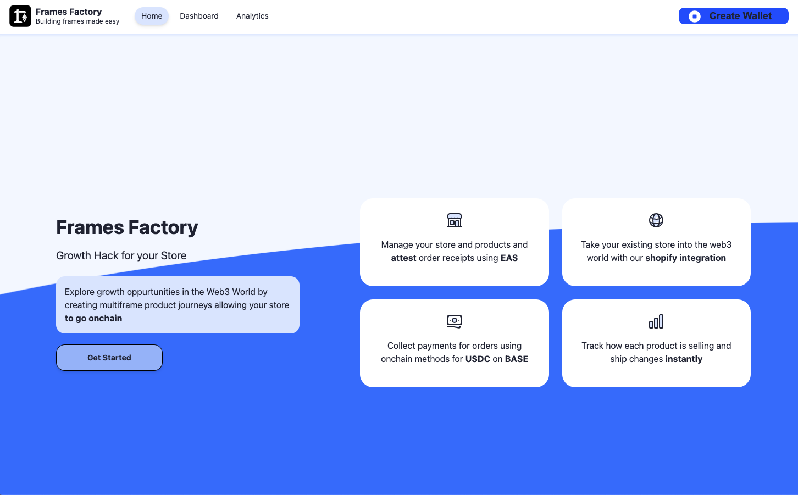
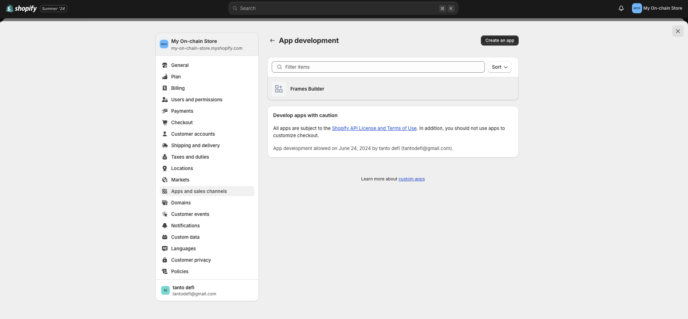
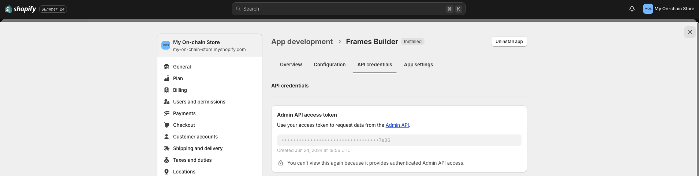
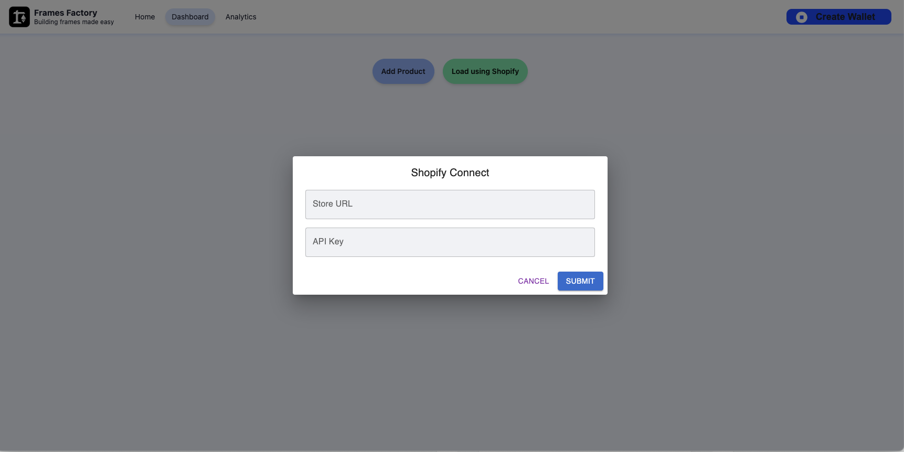

    <h1>🏗 Framify</h1>

 

    <a href="https://framify-seven.vercel.app/">App Demo Link</a> | <a href="https://my-on-chain-store.myshopify.com/">Example Shopify Store</a>

  

    Built for <a href="https://onchain-summer.devfolio.co/">Onchain Buildathon</a> and <a href="https://eas-onchain-summer.devfolio.co/">Attestation Summer</a> 2024 for <a href="https://attest.org/">EAS</a> and <a href="https://www.base.org/">BASE</a> by a based team of <a href="https://buidlguidl.com/">BuidlGuidl</a> members

 

    <a href="https://github.com/bhavyagor12">bhavyagor12</a> | <a href="https://github.com/ishaan812">ishaan812</a> | <a href="https://github.com/kenilshahh">kenilshahh</a> | <a href="https://github.com/JollyRogerz">JollyRogerz</a> | <a href="https://github.com/tantodefi">tantodefi</a>

 

## Application Features

- easy no-code Farcaster Frames builder
- support for multiple kinds of frames
- support for product frames with built-in  support for transactions in USDC on BASE within frames
- shopify integration to facilitate GET-ing product information for frames via shopify ADMIN api (requires store url + API key)
- visual slideshow-like  editor UI
- onchain attestations for receipt data for transactions using EAS

Creation of Frame Story:
Utilize the no-code frame builder provided by "hojayega" to allow users to easily create multi-page frames without the added complexity
Each step of the storyrepresents a frame, users here edit and customize look and feel according to their requirements.
Have a on the go preview to get a representation of the frame being created.

Removing Complexity for Frame Creation:
"hojayega" offers a simplified approach to creating frames by abstracting away the complexity of metadata-based HTML frames.
Users can focus on adding content and designing their frames using the no-code platform without worrying about intricate metadata tags.
The platform generates the necessary metadata behind the scenes, allowing users to create interactive and authenticated experiences seamlessly.

Shipping Frames to Warpcast:
Integrate the ability for users to directly ship their frames from the no-code builder to Warpcast, 
Upon completing the design of their story, users can seamlessly cast their frames to Warpcast from the dashboard.
The platform handles the generation of the necessary frame definitions and interactions with the Farcaster Hub for validation or additional data, enabling users to share their product stories with Warpcast users.

Tracking Analytics and Product Performance:
Dashboard keeps a track of all the stories created by the user. 
Emables us to leverage technologies like FARCASTER HUB to pull in data to showcase to the user on the fly for the particular story

## Technologies Used

- 🏗 <a href="https://scaffoldeth.io/">Scaffold-ETH 2</a>
- 🔵 <a href="https://www.coinbase.com/en-ca/wallet/smart-wallet">Coinbase Smart Wallet</a>
- <a href="https://www.mongodb.com/">mongoDB</a>
- <a href="https://www.shopify.com/">shopify</a> and their <a href="https://shopify.dev/docs/api">Admin API</a>
- <a href="https://docs.farcaster.xyz/learn/what-is-farcaster/frames">Farcaster Frames</a>
- <a href="https://docs.attest.org/docs/developer-tools/eas-sdkv">EAS SDK</a>

## Contracts 

<b>payment contract address:</b> <a href="https://sepolia.basescan.org/address/0x151630785016e17378ca5ac7eF2b0936a3e5C64f">0x151630785016e17378ca5ac7eF2b0936a3e5C64f</a>

Handles the payment for a product in the transaction frames

<b>EAS schema contract address / UID:</b> <a href="https://base-sepolia.easscan.org/schema/view/0x6cf920b46db9fc89b78efe8c06f77f1d169ab43faec920161e4c3247daff3717">0x6cf920b46db9fc89b78efe8c06f77f1d169ab43faec920161e4c3247daff3717</a>

Schema that we have for users to 'attest' to the order receipt details onchain to share with customer in warpcast DM later

## How it works 
- Firstly mint usdc token on base sepolia towards your address so that you can try out framify. You need to hit the mint function and you can only mint 100 usdc tokens everytime as of yet so just put your address and 100 in the amount field and you will get 100 usdc in your wallet 
https://sepolia.basescan.org/address/0x151630785016e17378ca5ac7eF2b0936a3e5C64f#writeContract 

## Shopify Integration

Example onchain smoothie shopify store: https://my-on-chain-store.myshopify.com/

In order to use our shopify integration we require users to create a custom app with access to the ADMIN api and permissions enabled for the 'read_products' scope. See the images below.

We require users input the shopify url + their API key to GET their product data and create product frames.

## Example Frames

## Similar Products

- <b>Frames built by PERCS:</b> Create a Farcaster Frame with selected products from your store. Basic frame creation.
